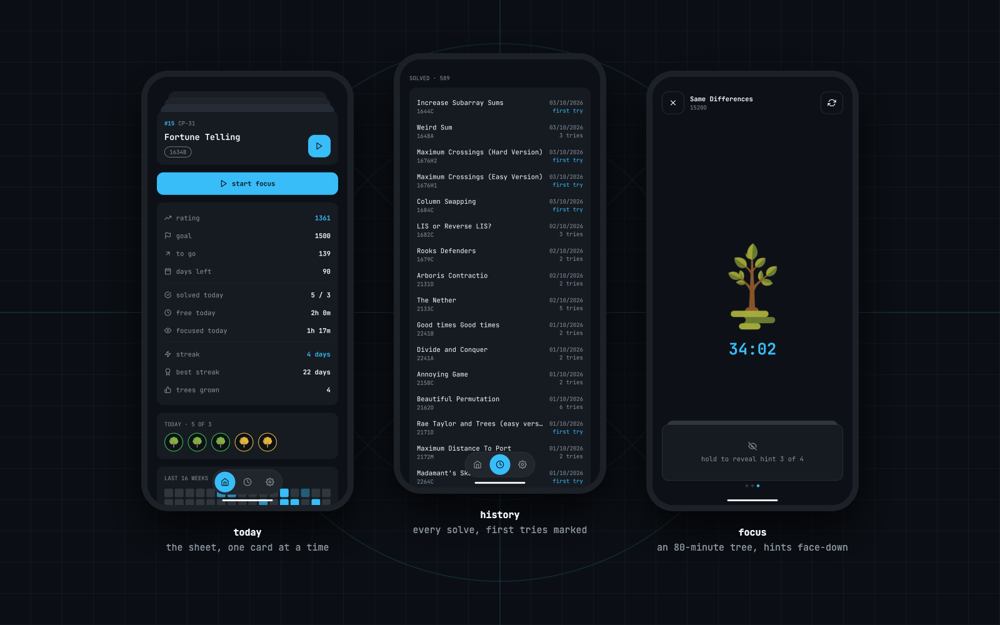

# codeforces buddy

A focus buddy for one friend's road to Codeforces 1800. Built for [Rajeev](https://codeforces.com/profile/ksrkasyap) for the DEV Hacktoberfest Weekend Challenge: *Build for a Friend*.

He solves on his laptop. The phone sits beside it with a tree growing for 80 minutes; leave the app and the tree dies.



## What it does

- **Today:** the next problems from TLE Eliminators' CP-31 sheet, picked up from his latest new sheet solve (or any unsolved problem 100–300 above his rating). Fixed for the day, as a swipeable card stack.
- **Focus:** a tree that grows through eight stages over 80 minutes and dies if he leaves the app for more than 10 seconds. An accepted Codeforces submission saves it.
- **Hints:** on-device Gemma reads the problem's editorial (code stripped) and writes four graded hints. They sit face-down; hold a card to reveal the next one.
- **Progress:** daily tree row, streaks, a 16-week heatmap, solve history, and a home screen widget (tap the tree to refresh).
- Solved means Codeforces says `OK`. Re-solves don't count.

## Run it

Android only, as an Expo dev build.

```bash
npm install
npm run android   # build and install on a device or emulator
npm start         # JS only, once the dev build is installed
npm test
```

Release APKs are built by GitHub Actions on every `v*` tag and attached to the [releases](https://github.com/Aravind-Sathesh/Codeforces-Buddy/releases).

## How it's built

- Expo SDK 57, React Native 0.86, TypeScript strict.
- **Gemma 4 E2B** (4-bit QAT GGUF, ~2.6 GB) runs on the phone through [`llama.rn`](https://github.com/mybigday/llama.rn) (llama.cpp). Downloaded once, on request.
- Plain code computes every number (targets, ratings, the problem queue). Gemma only writes hints and roasts.
- One Codeforces client, at most one request every 2 seconds.

| Where | What |
|---|---|
| `src/plan.ts` | daily target, candidates, CP-31 queue |
| `src/cf.ts` | rate-limited Codeforces client |
| `src/gemma.ts`, `src/prompts.ts` | on-device model, prompts, output filters |
| `src/screens/` | Today, Focus, History, Settings |
| `src/TodayWidget.tsx` | home screen widget |
| `__tests__/` | tests for the pure logic |

The product notes are in [IDEA.md](IDEA.md), and the rules for agents working here are in [AGENTS.md](AGENTS.md).

## Privacy

No backend, no analytics, no account. The calendar is read only as `{ start, end }` busy blocks; titles and attendees are dropped where they're read. Gemma runs on the device, and nothing leaves the phone except requests to the public Codeforces API.

## Credits

- Problems and data from the [Codeforces API](https://codeforces.com/apiHelp).
